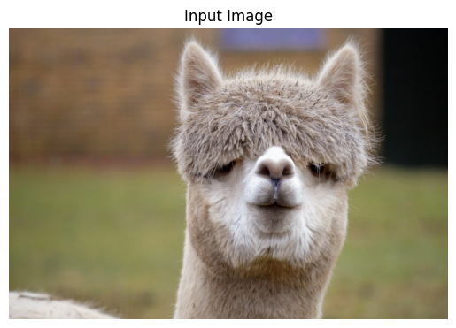
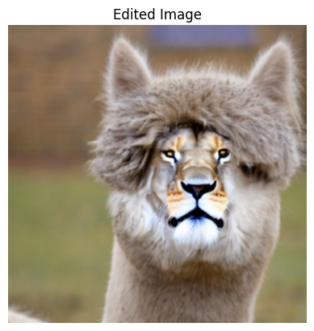
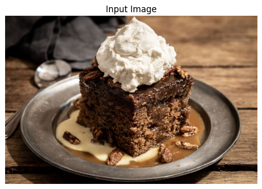
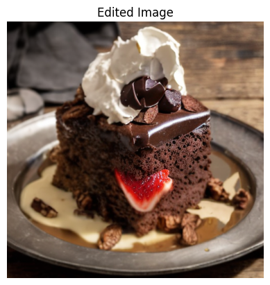
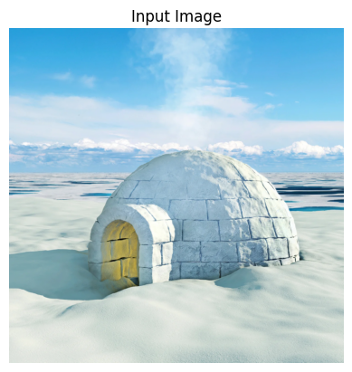
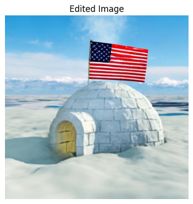
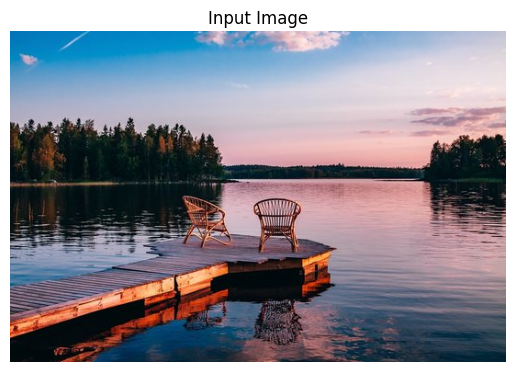
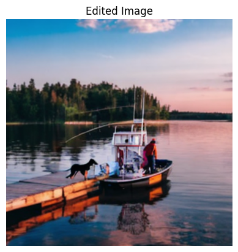
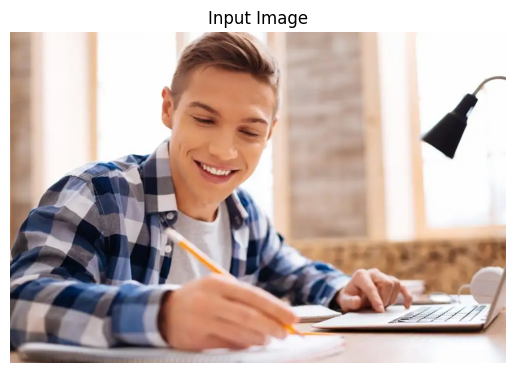
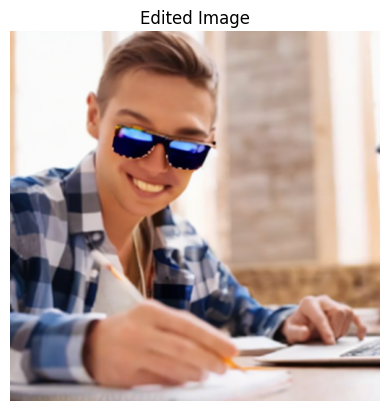

# Text-Driven Image Editing via Learnable Regions <br /> (CVPR 2024)

[](https://openaccess.thecvf.com/content/CVPR2024/papers/Lin_Text-Driven_Image_Editing_via_Learnable_Regions_CVPR_2024_paper.pdf)
[](https://arxiv.org/pdf/2311.16432) 
[](https://yuanze-lin.me/LearnableRegions_page/)
[](https://colab.research.google.com/drive/1mRWzNOlo_RR_zvrnHODgBoPAa59vGUdz#scrollTo=v_4gmzDOzN98)
[](https://www.youtube.com/watch?v=FpMWRXFraK8&feature=youtu.be)

## Independent Study Project
This implementation was reproduced and analyzed as part of my Independent Study project for Fall 2024 under the supervision of **Dr. Paul Rad**. The study aimed to reproduce the original results and extend the analysis by testing the model on datasets and scenarios beyond those in the original paper. This additional exploration helped evaluate the model's adaptability and compatibility with unseen data and complex editing tasks.**You can find it in `My_Learnble_Regions_v2_ipynb.ipynb`.**


[Yuanze Lin](https://yuanze-lin.me/), [Yi-Wen Chen](https://wenz116.github.io/), [Yi-Hsuan Tsai](https://sites.google.com/site/yihsuantsai/), [Lu Jiang](http://www.lujiang.info/), [Ming-Hsuan Yang](https://faculty.ucmerced.edu/mhyang/)

> Abstract: Language has emerged as a natural interface for image editing. In this paper, we introduce a method for region-based image editing driven by textual prompts, without the need for user-provided masks or sketches. Specifically, our approach leverages an existing pre-trained text-to-image model and introduces a bounding box generator to find the edit regions that are aligned with the textual prompts. We show that this simple approach enables flexible editing that is compatible with current image generation models, and is able to handle complex prompts featuring multiple objects, complex sentences, or long paragraphs. We conduct an extensive user study to compare our method against state-of-the-art methods. Experiments demonstrate the competitive performance of our method in manipulating images with high fidelity and realism that align with the language descriptions provided.


## Method Overview


## Contents

- [Install](#install)
- [Edit Single Image](#edit_single_image)
- [Edit Multiple Images](#edit_multiple_images)
- [Custom Image Editing](#custom_editing)
- [Reproduction and Extended Experiments](#reproduction_and_experiments)

## Getting Started

### :hammer_and_wrench: Environment Installation <a href="#install" id="install"/>
To establish the environment, just run this code in the shell:
```
git clone https://github.com/yuanze-lin/Learnable_Regions.git
cd Learnable_Regions
conda create -n LearnableRegion python==3.9 -y
source activate LearnableRegion
pip install torch==2.0.1 torchvision==0.15.2 torchaudio==2.0.2 --index-url https://download.pytorch.org/whl/cu118
conda env update --file enviroment.yaml
```
That will create the environment ```LearnableRegion``` we used.

### :tophat: Edit Single Image <a href="#edit_single_image" id="edit_single_image"/>
Run the following command to start editing a single image.

**Since runwayml has removed its impressive inpainting model ('runwayml/stable-diffusion-inpainting'),
if you haven't stored it, please set `--diffusion_model_path 'stabilityai/stable-diffusion-2-inpainting'`.**

```
torchrun --nnodes=1 --nproc_per_node=1 train.py \
	--image_file_path images/1.png \
	--image_caption 'trees' \
	--editing_prompt 'a big tree with many flowers in the center' \
        --diffusion_model_path 'stabilityai/stable-diffusion-2-inpainting' \
	--output_dir output/ \
	--draw_box \
	--lr 5e-3 \
	--max_window_size 15 \
	--per_image_iteration 10 \
	--epochs 1 \
	--num_workers 8 \
	--seed 42 \
	--pin_mem \
	--point_number 9 \
	--batch_size 1 \
	--save_path checkpoints/
```

The editing results will be stored in ```$output_dir```, and the whole editing time of one single image is about 4 minutes with 1 RTX 8000 GPU.  

You can tune `max_window_size`, `per_image_iteration` and `point_number` for adjusting the editing time and performance.

### :space_invader: Edit Multiple Images <a href="#edit_multiple_images" id="edit_multiple_images"/>
Run the following command to start editing multiple images simultaneously.

```
torchrun --nnodes=1 --nproc_per_node=2 train.py \
	--image_dir_path images/ \
	--output_dir output/ \
	--json_file images.json \
        --diffusion_model_path 'stabilityai/stable-diffusion-2-inpainting' \
	--draw_box \
	--lr 5e-3 \
	--max_window_size 15 \
	--per_image_iteration 10 \
	--epochs 1 \
	--num_workers 8 \
	--seed 42 \
	--pin_mem \
	--point_number 9 \
	--batch_size 1 \
	--save_path checkpoints/ 
```

## Reproduction and Extended Experiments <a href="#reproduction_and_experiments" id="reproduction_and_experiments"/>

### Reproduction of Results
The results presented in the paper were successfully reproduced using the provided datasets and prompts. The outputs demonstrated high fidelity and alignment with the textual descriptions, validating the claims made in the original work.

### Extended Experiments
To assess the model's robustness and compatibility, additional experiments were conducted:

1. **Testing on Unseen Prompts and Images**: The model was tested on datasets and prompts beyond those used in training, such as landscape transformations, animal manipulations, and abstract descriptions. Results showcased the model’s adaptability to diverse scenarios.

2. **Generalization to Custom Data**: Real-world images and complex editing prompts were used to evaluate the model’s effectiveness. The results highlighted its ability to handle intricate edits with minimal artifacts.

3. **Comparative Analysis**: Results were compared against existing methods, demonstrating competitive performance and faster convergence in certain cases.

Below are some examples from the extended experiments:
| Input Image            | Output Image           | Prompt                |
|-------------------------|------------------------|-----------------------|
|  |  | "a lion with a massive mane" |
|    |    | "a chocolate cake with whipped cream and diced strawberries"        |
|   |   | "the USA flag flying on top of the igloo"    |
|    |    | "a fishing boat on the water and two dogs on the deck"  |
|    |    | "a student wearing sunglasses"  |


